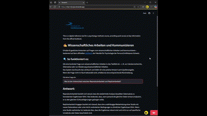

# Vorlesungsskript Chat
Get instant answers to your questions about psychological research methods and scientific writing including references to relevant passages in the book ["Wissenschaftliches Arbeiten und Kommunizieren"](https://wissarbkom.bitbucket.io/) by Nicolas Rothen and Alodie Rey-Mermet.

## About the project
This project is an app that allows users to chat about the contents of a knowledge base, specifically focused on scientific writing and communication in psychology. The app uses a large language model to generate answers based on the context retrieved from the embedded documents, providing users with fast and precise responses to their questions.

## Getting started
* You need an OpenAI API key saved in the ".env" file (OPENAI_API_KEY = "your-key-comes-here"). The .env file is git-ignored.
* Create environment in cmd terminal (if not done yet): `python -m venv venv`
* Activate environment (on Windows): `venv\Scripts\activate`
* To install all required packages run `pip install -r requirements.txt`
* (To save the current packages: `pip freeze > requirements.txt`)
* Then run the command in cmd terminal `streamlit run app.py` to run the app on localhost. You can ask questions about the embedded document (see example questions below). The chat returns relevant passages of the embedded documents. Based on this context, the chat then generates an answer. It should only answer when the question is related to the content of the embedded documents (try the trick question below).

### Example questions:
* Was ist der Unterschied zwischen Reproduzierbarkeit und Replizierbarkeit?
* Wie werden Abbildungen formatiert?
* Muss ich Inferenzstatistik auf einem Poster berichten?

### Trick question:
* Was ist die Reihenfolge der Planeten in unserem Sonnensystem?

## Detailed description of the components
### 1. Parse Quarto files
* `parseQuarto.py` parses and cleans contents from Quarto files in the subfolder "QuartoFiles" and saves it as `document.json`. This file is then used for embedding (see `embed.py`).

### 2. Create embeddings
* `embed.py` loads environment variables and initializes the OpenAI client with the API key.
* Loads document data from a JSON file.
* Computes embeddings for each section of the documents and stores them in a CSV file. This file is then used for semantic search (see `utils.py`)

### 3. Start chatting (on localhost)
* enter in terminal: `streamlit run app.py`

### Models used
* OpenAI's `text-embedding-3-small` for creating embeddings.
* OpenAI's `gpt-3.5-turbo` for generating answers based on the context retrieved from the document base.
* Maybe switch to `gpt-4` if quality and reliability are priorities. Use GPT-3.5 Turbo if speed or budget is critical.

## Evaluation
The notebook `eval.ipynb`evaluates retrieval performance on over 70 question-context pairs (cf. `testset.xlsx`). Retrieval accuracy reaches 91%. Results are saved in `retrieval_evaluation_results.csv`. 
Retrieval speed is ... . This could be improved by using a vector database and proper indexing.

Generated responses to these questions were manually evaluated for correctness. Overall, the answers were correct with a few exceptions marked in orange in the column "expected_answer" in `testset.xlsx`. This may be overcome with a more powerful model like GPT-4.

## Next steps
- [x] Create a frontend
- [x] Fix problems related to Swiss German
- [ ] Implement hybrid search (semantic search + keyword search) for higher similarity scores
- [ ] evaluate retrieval speed
- [ ] use vector DB and indexing for faster performance
- [ ] try other (open source) embedding models like [snowflake-arctic-embed](https://huggingface.co/Snowflake/snowflake-arctic-embed-l-v2.0)  
- [ ] evaluate retrieval performance with other embedding models
- [ ] try other (open source) LLMs like [Llama 3](https://ollama.com/library/llama3), or [qwen](https://ollama.com/library/qwen3)
- [ ] evaluate answer quality with other LLMs

